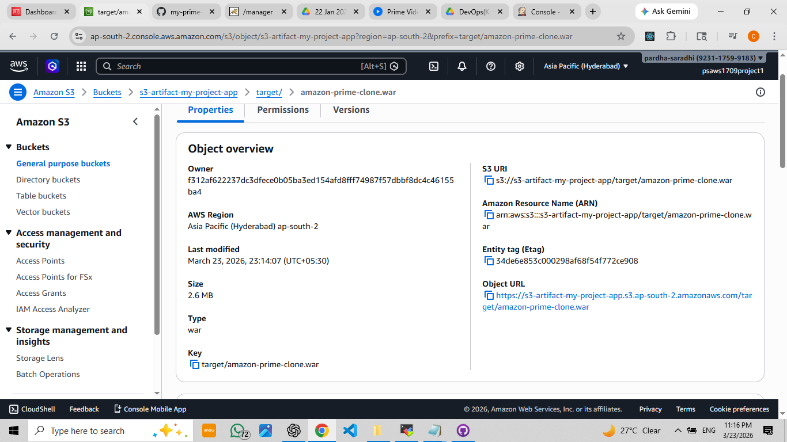

# my-jenkins-project

This project demonstrates **building and deploying artifacts using Jenkins**, and storing them in **AWS S3**.  
It shows how a web application can be automatically built, deployed on **Tomcat**, and backed up to S3.

---

## Project Overview
- **Build Automation**: Jenkins pipelines build your project automatically.
- **Artifact Deployment**: Deploy `.war` or other artifacts to Tomcat server.
- **S3 Storage**: Artifacts are stored in AWS S3 for backup or distribution.

---

## Architecture

### 1️⃣ Application Path
  
*Shows the project folder structure and application flow.*

### 2️⃣ Jenkins Build Status
  
*Shows the Jenkins job build status.*

### 3️⃣ Deploy Artifact
  
*Deployment of artifact to Tomcat server.*

### 4️⃣ Alternative Deployment View
  
*Alternative view of deployment steps.*

### 5️⃣ Application Running
  
*Shows the application running on the web after deployment.*

### 6️⃣ Tomcat Server Running
  
*Tomcat server is running and serving the application.*

### 7️⃣ Artifact Stored in S3
  
*Artifacts are stored in AWS S3 bucket.*

---

## How to Use
1. Configure Jenkins and create a pipeline.
2. Connect your GitHub repository to Jenkins.
3. Build the project using the Jenkins job.
4. Deploy the artifact to Tomcat server.
5. Check the application running on your web browser.
6. Confirm the artifact is saved in S3.

---

## Notes
- Ensure AWS credentials are configured in Jenkins to allow S3 access.
- Tomcat must be running and reachable for deployment.
- All files and screenshots are included in the repository for reference.

---

